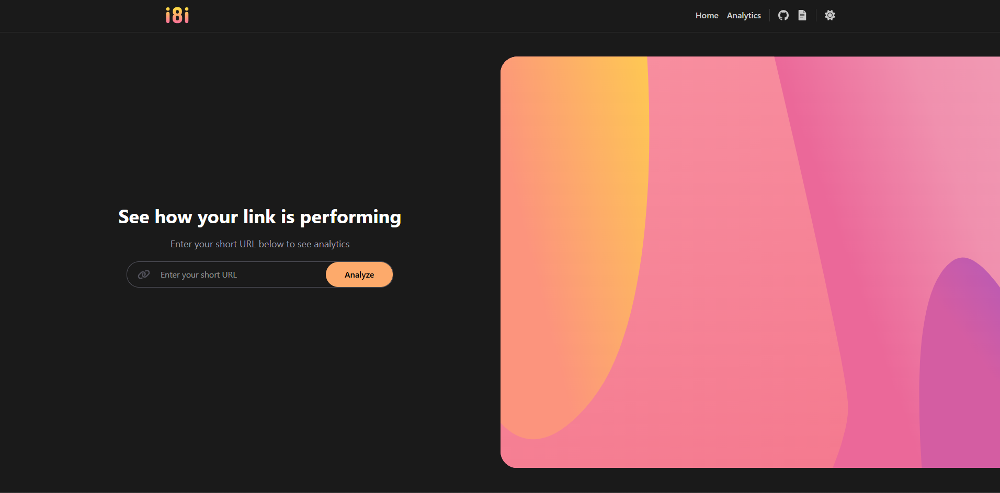

<h1 align="center">
  <br>
  <a href="http://i8i.pw"></a>
  <br>
  i8i.pw
  <br>
</h1>

<h4 align="center">Powerful open-source URL shortener with custom links, analytics, and security.</h4>

<p align="center">
  <a href="https://github.com/An4s0/i8i/stargazers">
    
</a>
<a href="https://github.com/An4s0/i8i/network/members">
    
</a>
<a href="https://github.com/An4s0/i8i/issues">
    
</a>
<a href="https://github.com/An4s0/i8i/discussions">
    
</a>
<a href="https://github.com/An4s0/i8i/blob/main/LICENSE">
    
</a>
</p>

<p align="center">
  <a href="#features">Features</a> •
  <a href="#installation">Installation</a> •
  <a href="#usage">Usage</a> •
  <a href="#technologies-used">Technologies Used</a> •
  <a href="#deployment">Deployment</a> •
  <a href="#license">License</a> •
  <a href="#contact">Contact</a>
</p>



<div id="features">

# Features
- 📊 Analytics: location, os and browser.
- 🔒 Password protection for links. 
- 🕒 Expiration settings for temporary links.
- 📌 QR code generation. (under development)
- 📡 API for developers. 

</div>

<div id="installation">

# Installation

To install and run the i8i URL shortener locally, follow these steps:

1. Clone the repository:
   ```bash
   git clone https://github.com/An4s0/i8i.git
   ```

2. Navigate to the project folder:
   ```bash
   cd i8i
   ```

3. Install the required dependencies:
   ```bash
   npm install
   ```

4. Start the server:
   ```bash
   npm run start
   ```

5. Visit the app in your browser:
   ```bash
   http://localhost:3000
   ```

</div>

<div id="usage">

# Usage

Once the server is running, you can access the i8i URL shortener by visiting the application in your browser. You can shorten URLs, view analytics, and manage your links.

- **Shorten a URL**: Simply input the long URL you want to shorten and click the "Shorten" button.
- **Analytics**: Track the performance of your links by checking clicks, user locations, os and browsers.
- **QR Codes**: Generate QR codes for any URL (coming soon).

</div>

<div id="technologies-used">

# Technologies Used

- **Next.js**: React framework
- **TypeScript**: Language
- **Tailwind CSS**: Styling
- **MongoDB**: Database
- **Vercel**: Deployment & Analytics
- **Chart.js**: Charts
- **UAParser.js**: User agent parsing

</div>

<div id="deployment">

# Deployment

To deploy the i8i URL shortener, you can use cloud platforms like Heroku, Vercel, or DigitalOcean.

1. Set up a production database in MongoDB Atlas or another cloud-based database service.
2. Configure environment variables in your cloud provider's dashboard:
   - `MONGODB_URL` for the database connection.
   - `NEXT_PUBLIC_APP_URL` for the application URL (e.g., `https://i8i.pw`).
3. Push the code to your cloud platform and configure the deployment settings.

</div>

<div id="license">

# License

This project is licensed under the MIT License - see the [LICENSE](LICENSE) file for details.

</div>

<div id="contact">

# Contact

For any inquiries, feel free to reach out:

- Email: [me+contact@ianas.me](mailto:me+contact@ianas.me)
- GitHub: [An4s0](https://github.com/An4s0)

</div>